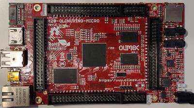

# Example Yocto Setup for A20-Olinuxino MICRO (Allwinner A20)
This is a template setup to build a Linux distribution using Yocto Styhead
that runs on the Olimex A20 Olinuxino MICRO board.

## Dependencies
See [Yocto Documentation](https://docs.yoctoproject.org/ref-manual/system-requirements.html)
~~~
$ sudo apt install gawk wget git diffstat unzip texinfo gcc build-essential chrpath socat cpio python3 python3-pip python3-pexpect xz-utils debianutils iputils-ping python3-git python3-jinja2 python3-subunit zstd liblz4-tool file locales libacl1
$ sudo locale-gen en_US.UTF-8
~~~

## Build
~~~
source ./oe-init-build-env
bitbake core-image-minimal
~~~
If you want to boot from the micro SD card, create an image:
~~~
cd build/tmp/deploy/images/olinuxino-a20
wic create core-image-minimal-sunxi-sdcard-image.wks -e core-image-minimal
~~~
Copy the image to your SD card using `dd`.
